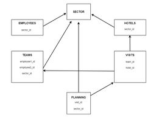

# API

http://35.180.253.143:9000/api/route

See full api documentation [here](http://35.180.253.143:9000/api/documentation/)

## :link: Built with

##### Production

- Express, a framework to build node applications
- Mongoose, to model mongodb objects
- Apidoc, to generate documentation
- Bcryptjs, to hash and validate password
- Cors, to allow cross-origin resource sharing
- Jsonwebtoken, to create a limited lifespan unique hashed key for user id
- Pdfkit, to create pdf files

##### Development

- ESLint and Prettier, to work together with the same syntax
- Morgan, to get a feedback of a request in terminal

## API Documentation

Automatically generate api documentation with comments.
Run the following command **from API folder**

<code>
	yarn apidoc -i ./routes -o ./apidoc
</code>

You can see full api documentation [here](http://35.180.253.143:9000/api/documentation/) or on http://localhost:9000/api/documentation/ if you are in development mode

## Architecture

```sequence
Back Office or Mobile App->API: 1 - Request URL to API
Note right of API: 2 - API process request
API->Database: 3 - Request Data
Database-->API: 4 - Send Data
API->Back Office or Mobile App: 5 - Send Data to front
```

## Data Modelling

## Authentication principles

## Author

Ketsia Pedro
